# Hi, I'm Robert Martinez 👋

Full-stack engineer from Asunción, Paraguay. Working at **Toptal @ Databricks**, building with TypeScript, Python, and modern web frameworks.

## About Me

## Tools

## Technology Stack

## Stats

<!--START_SECTION:waka-->
<!--END_SECTION:waka-->
